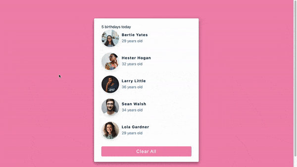

## Summary

Let's start with basic state and do a clear all click with birthday card today!

- `useState()` to render all people in the list.
- A click button to clear all



## File structure

```
.
├── README.md
├── package-lock.json
├── package.json
└── src
    ├── App.js
    ├── List.js
    ├── data.js
    ├── index.css
    └── index.js
```

## Available Scripts

In the project directory, you can run:

### `npm start`

Runs the app in the development mode.\
Open [http://localhost:3000](http://localhost:3000) to view it in your browser.
